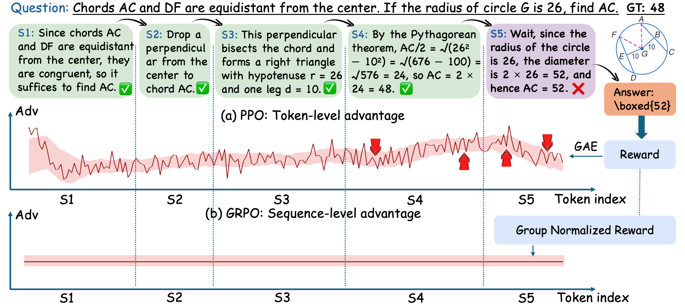
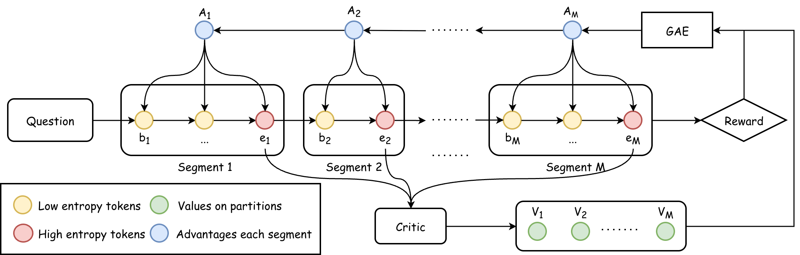

<div align="center">

# 🧩 Segment-Aligned Policy Optimization for Multi-Modal Reasoning

<p>
  <a href="https://github.com/Graysonicc/SAPO/tree/main">
    
  </a>
  <a href="http://arxiv.org/abs/2605.01327">
    
  </a>
  <a href="https://github.com/verl-project/verl/tree/v0.4.1">
    
  </a>
</p>

<p>
  <b>Segment-level credit assignment for long-chain multi-modal reasoning.</b><br>
  SAPO aligns reinforcement learning updates with coherent reasoning segments rather than isolated tokens or entire responses.
</p>

</div>

---

## ✨ Highlights

- 🧠 **Reasoning-step aligned optimization**: SAPO treats coherent reasoning segments as the basic units of policy optimization.
- 🎯 **Fine-grained credit assignment**: It avoids both noisy token-level advantages and overly coarse sequence-level rewards.
- 📈 **Segment-level value / advantage estimation**: SAPO introduces segment-wise value modeling, GAE-style advantage computation, and importance sampling.
- 🔍 **Entropy-based adaptive segmentation**: High-entropy tokens are used as natural decision points to partition long reasoning trajectories.

---

## 📝 Paper at a Glance

**Segment-Aligned Policy Optimization for Multi-Modal Reasoning** studies a key mismatch in current RL training for large language / multi-modal models:

> Reasoning is naturally step-wise, but many RL methods optimize either at the token level or at the whole-response level.

This mismatch can make credit assignment unstable:

| Granularity | Typical Method | Limitation |
| --- | --- | --- |
| 🔬 Token-level | PPO-style token advantage | Too fine-grained; tokens inside the same reasoning step may receive inconsistent signals. |
| 📦 Sequence-level | GRPO-style response reward | Too coarse-grained; correct intermediate steps may be penalized when only the final answer is wrong. |
| 🧩 Segment-level | **SAPO** | Aligns policy updates with coherent reasoning steps, giving more semantically meaningful credit. |

SAPO reformulates policy optimization from a **step-wise MDP** perspective. Each action corresponds to generating a coherent reasoning segment. This allows the algorithm to estimate values and advantages at the segment level, producing learning signals that better match the structure of chain-of-thought reasoning.

---

## 🖼️ Method Overview

<div align="center">
  
  <br>
  <b>Figure 1.</b> Credit assignment granularity in long-chain reasoning. Token-level optimization can produce noisy signals, while sequence-level optimization cannot distinguish useful intermediate reasoning steps from final mistakes.
</div>

<br>

<div align="center">
  
  <br>
  <b>Figure 2.</b> SAPO framework. Responses are partitioned by entropy-aware reasoning boundaries, and segment-level values / advantages are estimated for policy optimization.
</div>

---

## 🧰 What SAPO Adds

```text
Question / Multi-modal Input
        │
        ▼
Model generates a long reasoning trajectory
        │
        ▼
Entropy-aware segmentation finds reasoning-step boundaries
        │
        ▼
Critic estimates segment-level values
        │
        ▼
GAE computes segment-level advantages
        │
        ▼
Policy update uses segment-aligned importance sampling
```

In short, SAPO replaces the question:

> “Which token or whole response should receive reward?”

with the more reasoning-aware question:

> “Which reasoning segment actually contributed to success or failure?”


---

## ⚙️ Installation

SAPO is built on top of [VeRL](https://verl.readthedocs.io/en/latest/start/install.html). The current codebase follows **VeRL v0.4.1**.

Create the environment:

```bash
conda create -n sapo python==3.10
conda activate sapo
```

Recommended package versions:

```text
verl == 0.4.1
vllm == 0.8.4
trl == 0.14.0
ray == 2.46.0
torch == 2.6.0+cu124
transformers == 4.57.1
flash-attn == 2.7.4.post1
```

Install dependencies according to the VeRL installation guide.

---

## 🚀 Training

The main SAPO training entry is:

```bash
cd SAPO
bash examples/ppo_trainer/run_sapo.sh
```
You can view the training and testing curves by launching TensorBoard.

The key configuration switch is:

```bash
TOPK_PERCENT=30.0
algorithm.adv_estimator=sapo
```


---


## 📌 Why Segment Alignment Matters

Long-chain reasoning failures are often localized. A model may solve most of a problem correctly but make a small mistake near the end. If training only sees the final reward, it may suppress useful intermediate reasoning. If training assigns credit token by token, it may introduce high-variance noisy updates.

SAPO aims for the middle ground:

<div align="center">

| Token | Token | Token | ➜ | **Reasoning Segment** | ➜ | Policy Update |
| :---: | :---: | :---: | :---: | :---: | :---: | :---: |
| noisy | noisy | noisy | 🧩 | coherent step | 🎯 | stable signal |

</div>

This segment-aligned view makes the optimization unit closer to how humans read and evaluate reasoning processes.


---

## ✅ Citation

If you find this code useful for your research, please cite:

```bibtex
@article{gao2026segment,
  title={Segment-Aligned Policy Optimization for Multi-Modal Reasoning},
  author={Gao, Lei and Li, Zhuoming and Jia, Mengxi and Yuan, Jiakang and Sun, Hongbo and Sun, Hao and Li, Xuelong},
  journal={arXiv preprint arXiv:2605.01327},
  year={2026}
}
```

---

<div align="center">

### ⭐ If SAPO helps your research, please consider starring the repo!

<sub>🧩 Segment-aligned RL · 🧠 Multi-modal reasoning · 🚀 Stable policy optimization</sub>

</div>
